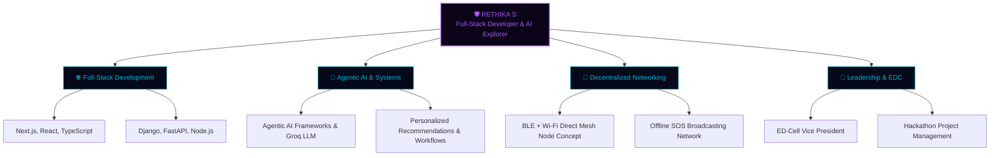
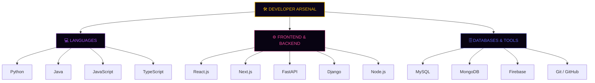

  <!-- DYNAMIC LIVE ANIMATED BANNER (Compiled from character illustration) -->
  

    

  <!-- DYNAMIC TYPING SVG ANIMATION VIOLET THEME -->
  

    

  <!-- PROFILE HUBS & BADGES -->
  
  
  

    

  <!-- QUICK-JUMP NAVIGATION HUB -->
  
  
  
  
  

    

  <!-- CONNECT CHANNELS -->
  
  
  
  

 

---

## 💻 PROFILE DOSSIER

  <!-- DYNAMIC LIVE SYSTEM AUDIT ANIMATION -->
  

 

> 💬 *"Computer Science & Engineering undergraduate with a strong academic foundation (9.52 CGPA) and passion for building modular full-stack solutions. Actively combining TypeScript, Next.js, Django, and FastAPI with Agentic AI workflows to develop intelligent, scalable web and decentralized software platforms."*

---

## 🌲 DOMAIN ARCHITECTURE

---

## 🛠️ TECH STACK & ARSENAL

 

  <table>
    <tr>
      <td bgcolor="#05030c" style="border: 1px solid #7c6f9f; border-radius: 8px; padding: 18px; width: 100%;">
        <pre style="background: transparent; color: #a855f7; font-family: 'Fira Code', monospace; text-align: left; margin: 0; line-height: 1.6; font-size: 13px;">
rethika@ai-engine:~/skills$ tree ./languages_and_tools/
.
├── 💻  LANGUAGES
│   ├── [✓] Python .............. Primary language for AI &amp; Backend development
│   ├── [✓] Java ................ OOP Core &amp; Application Development
│   ├── [✓] JavaScript .......... Web interactions &amp; frontend logic
│   └── [✓] TypeScript .......... Typed web client scripting (Next.js)
│
├── ⚙️  FRONTEND_AND_BACKEND
│   ├── [✓] React.js ............ Declarative component library
│   ├── [✓] Next.js ............. Server-rendered frontend framework
│   ├── [✓] FastAPI ............. High-speed backend REST APIs
│   ├── [✓] Django .............. Robust database-driven MVC APIs (started)
│   └── [✓] Node.js ............. Event-driven JS runtime server
│
└── 🗄️  DATABASES_AND_TOOLS
    ├── [✓] MySQL / MongoDB ..... Relational &amp; Document storage backends
    ├── [✓] Firebase ............ Serverless authentication &amp; DB models
    └── [✓] Git &amp; GitHub ........ Collaborative version control
        </pre>
      </td>
    </tr>
  </table>

---

## 🚀 FEATURED PROJECTS PORTFOLIO

<table width="100%">
  <!-- Project 1: SmartLife AI -->
  <tr>
    <td bgcolor="#0a0518" style="border: 2px solid #a855f7; border-radius: 12px; padding: 22px;">
      

        AGENTS &amp; AI BANKING
        <h3 style="margin-top: 0; color: #a855f7; font-family: sans-serif; font-size: 20px;">🤖 SmartLife AI — Agentic Banking Companion</h3>
        

          An agentic AI-powered banking assistant that proactively engages customers based on life events, financial goals, and behavioral patterns. Designed personalized recommendation workflows for savings, investment, and insurance products using AI-driven customer profiling.
        

        <b>Tech Stack:</b> Python · Agentic AI Frameworks · Kaggle Datasets · Antigravity Prototype
      

    </td>
  </tr>
  
  <tr><td height="16"></td></tr>
  
  <!-- Project 2: SolvurAI -->
  <tr>
    <td bgcolor="#031622" style="border: 2px solid #06b6d4; border-radius: 12px; padding: 22px;">
      

        AI DIALOGUE &amp; HACKATHON
        <h3 style="margin-top: 0; color: #06b6d4; font-family: sans-serif; font-size: 20px;">🌐 SolvurAI — AI Tamil Dialogue &amp; Expression Platform</h3>
        

          Built a full-stack AI-powered Tamil educational platform with dialogue generation, grammar evaluation, and Tanglish-to-Tamil conversion using Groq LLM, Firebase, and Next.js. Developed and showcased for the <b>DTEC 2026 Hackathon</b>.
        

        

          <a href="https://solvurai.vercel.app" style="color: #22d3ee; font-family: sans-serif; font-size: 14px; text-decoration: none; font-weight: bold;">🔗 Visit Live Site: solvurai.vercel.app</a>
        

        <b>Tech Stack:</b> Next.js · TypeScript · FastAPI · Firebase · Groq LLM · Vercel
      

    </td>
  </tr>
  
  <tr><td height="16"></td></tr>
  
  <!-- Project 3: Routeverse AI -->
  <tr>
    <td bgcolor="#150416" style="border: 2px solid #ec4899; border-radius: 12px; padding: 22px;">
      

        URBAN TRANSIT &amp; TWIN
        <h3 style="margin-top: 0; color: #ec4899; font-family: sans-serif; font-size: 20px;">⚡ Routeverse AI — Intelligent Urban Mobility Platform</h3>
        

          Built an AI-powered urban mobility platform combining route planning, Digital Twin city insights, transit intelligence, and emergency navigation. Integrated voice assistance and safety analytics to enhance real-time commuter decision-making and city-scale transit visibility. Developed for <b>SRMIST</b>.
        

        <b>Tech Stack:</b> TypeScript · Next.js · AI/ML Models · Digital Twin Architecture
      

    </td>
  </tr>

  <tr><td height="16"></td></tr>
  
  <!-- Project 4: LifeLink -->
  <tr>
    <td bgcolor="#02140d" style="border: 2px solid #10b981; border-radius: 12px; padding: 22px;">
      

        DECENTRALIZED RESCUE
        <h3 style="margin-top: 0; color: #10b981; font-family: sans-serif; font-size: 20px;">📡 LifeLink — Offline Disaster Communication Platform</h3>
        

          Building a decentralized emergency network that turns smartphones into BLE + Wi-Fi Direct mesh nodes for SOS broadcasting and rescue coordination without internet or cell towers. Pitch and concept designed for the <b>Confluence 2.0 Hackathon</b> (Currently under development).
        

        <b>Tech Stack:</b> BLE · Wi-Fi Direct · Android Sockets · Mesh Networking
      

    </td>
  </tr>

  <tr><td height="16"></td></tr>
  
  <!-- Project 5: Vaultéa -->
  <tr>
    <td bgcolor="#05081c" style="border: 2px solid #6366f1; border-radius: 12px; padding: 22px;">
      

        INFO VAULT &amp; SECURITY
        <h3 style="margin-top: 0; color: #6366f1; font-family: sans-serif; font-size: 20px;">🔒 Vaultéa — Personal Information Vault</h3>
        

          Built a secure personal vault system for storing sensitive data, diary entries, and expense records with analytics dashboards. Implemented 2FA authentication and encrypted vault storage to ensure secure, privacy-first data management.
        

        <b>Tech Stack:</b> React · Node.js · Express · MySQL
      

    </td>
  </tr>

  <tr><td height="16"></td></tr>
  
  <!-- Project 6: DoubtDesk -->
  <tr>
    <td bgcolor="#190e02" style="border: 2px solid #f59e0b; border-radius: 12px; padding: 22px;">
      

        QUERY RESOLUTION
        <h3 style="margin-top: 0; color: #f59e0b; font-family: sans-serif; font-size: 20px;">✍️ DoubtDesk — Student Doubt Tracker</h3>
        

          Built a full-stack academic query resolution platform with role-based authentication, MySQL-based doubt lifecycle tracking, and an accept-and-resolve answering workflow. Deployed on Render.
        

        <b>Tech Stack:</b> Python · Django · MySQL · Render Deployment
      

    </td>
  </tr>
</table>

---

## 🎓 ACADEMICS & LEADERSHIP TRACK

<table width="100%">
  <tr>
    <td width="50%" valign="top" bgcolor="#05030c" style="border: 1px solid #7c6f9f; border-radius: 8px; padding: 18px;">
      <h3 style="margin-top: 0; color: #a855f7;">🏆 Academic Rank Details</h3>
      <ul style="color: #cbd5e1; line-height: 1.6;">
        <li>🎓 <b>B.E. Computer Science Engineering</b> Jerusalem College of Engineering</li>
        <li>⭐ <b>Cumulative CGPA: 9.52 / 10.0</b></li>
        <li>🥇 <b>Semester 1 Rank</b>: 1st Position (9.68 GPA)</li>
        <li>🥈 <b>Semester 2 Rank</b>: 2nd Position (9.24 GPA)</li>
        <li>🥇 <b>Semester 3 Rank</b>: 1st Position (9.50 GPA)</li>
        <li>📈 <b>Secondary Education (HSC)</b>: 91.3%</li>
        <li>📈 <b>Secondary Education (SSLC)</b>: 95.8%</li>
      </ul>
    </td>
    <td width="50%" valign="top" bgcolor="#05030c" style="border: 1px solid #7c6f9f; border-radius: 8px; padding: 18px;">
      <h3 style="margin-top: 0; color: #ec4899;">💼 Leadership &amp; Certifications</h3>
      <ul style="color: #cbd5e1; line-height: 1.6;">
        <li>💼 <b>ED-Cell Vice President</b>: Vice President of the Entrepreneurship Development Cell at JCE. Managing college-level hackathons and pitch sessions.</li>
        <li>📜 <b>Honors Diploma</b>: Full Stack Development (HDFD) — CSC Pvt. Ltd.</li>
        <li>📜 <b>Infosys Springboard</b>: Pragati Cohort 9 Graduate.</li>
        <li>🔬 <b>Internships</b>: Completed 5 online internships (Codsoft, Tamizhan Skills (3), Elewate Labs).</li>
      </ul>
    </td>
  </tr>
</table>

---

## 💻 CODING PROFILES & ALGORITHMS

  
  &nbsp;&nbsp;
  

 

